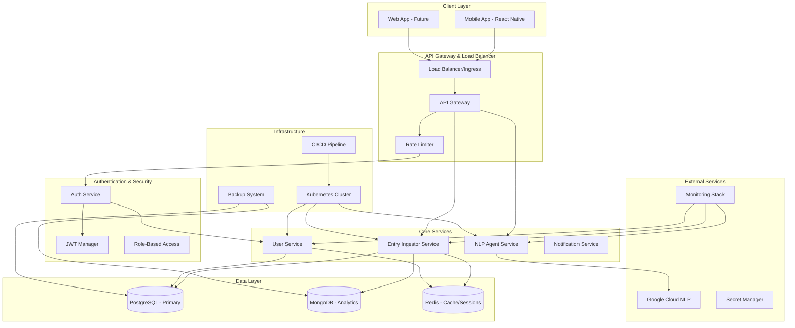

# Production Readiness Design Document

## Overview

This design document outlines the transformation of AURA JOURNAL from a development prototype into a production-ready mental journaling application. The design focuses on security, scalability, reliability, and maintainability while preserving the core functionality of AI-powered journaling with sentiment analysis.

The current architecture consists of a React Native mobile app with FastAPI microservices backend. We will enhance this foundation with production-grade features including authentication, security hardening, monitoring, deployment automation, and performance optimizations.

## Architecture

### High-Level Architecture



### Security Architecture

The security model implements defense-in-depth with multiple layers:

1. **Network Security**: TLS encryption, VPC isolation, firewall rules
2. **Authentication**: JWT-based auth with refresh tokens
3. **Authorization**: Role-based access control (RBAC)
4. **Data Protection**: Encryption at rest and in transit
5. **API Security**: Rate limiting, input validation, CORS policies
6. **Infrastructure Security**: Container scanning, secret management

## Components and Interfaces

### 1. Authentication Service

**Purpose**: Centralized user authentication and authorization

**Key Features**:
- User registration and login
- JWT token generation and validation
- Password hashing with bcrypt
- Session management with Redis
- Multi-factor authentication support

**API Endpoints**:
```
POST /auth/register
POST /auth/login
POST /auth/refresh
POST /auth/logout
GET /auth/profile
PUT /auth/profile
POST /auth/change-password
```

**Database Schema**:
```sql
CREATE TABLE users (
    user_id UUID PRIMARY KEY DEFAULT gen_random_uuid(),
    email VARCHAR(255) UNIQUE NOT NULL,
    password_hash VARCHAR(255) NOT NULL,
    first_name VARCHAR(100),
    last_name VARCHAR(100),
    is_active BOOLEAN DEFAULT true,
    is_verified BOOLEAN DEFAULT false,
    created_at TIMESTAMP DEFAULT CURRENT_TIMESTAMP,
    updated_at TIMESTAMP DEFAULT CURRENT_TIMESTAMP,
    last_login TIMESTAMP
);

CREATE TABLE user_sessions (
    session_id UUID PRIMARY KEY DEFAULT gen_random_uuid(),
    user_id UUID REFERENCES users(user_id) ON DELETE CASCADE,
    refresh_token_hash VARCHAR(255) NOT NULL,
    expires_at TIMESTAMP NOT NULL,
    created_at TIMESTAMP DEFAULT CURRENT_TIMESTAMP,
    is_active BOOLEAN DEFAULT true
);
```

### 2. Enhanced Entry Ingestor Service

**Current State**: Basic entry creation with NLP integration
**Enhancements**: 
- User-specific entry access
- Data encryption
- Audit logging
- Performance optimization

**New API Endpoints**:
```
GET /entries?page=1&limit=20&sort=desc
GET /entries/{entry_id}
PUT /entries/{entry_id}
DELETE /entries/{entry_id}
GET /entries/search?q=keyword&from_date=2024-01-01
GET /entries/analytics/summary
```

**Enhanced Database Schema**:
```sql
CREATE TABLE journal_entries (
    entry_id UUID PRIMARY KEY DEFAULT gen_random_uuid(),
    user_id UUID REFERENCES users(user_id) ON DELETE CASCADE,
    content_encrypted TEXT NOT NULL,
    content_hash VARCHAR(64) NOT NULL,
    timestamp TIMESTAMP DEFAULT CURRENT_TIMESTAMP,
    updated_at TIMESTAMP DEFAULT CURRENT_TIMESTAMP,
    is_deleted BOOLEAN DEFAULT false,
    metadata JSONB,
    INDEX idx_user_timestamp (user_id, timestamp DESC),
    INDEX idx_user_deleted (user_id, is_deleted)
);

CREATE TABLE entry_analytics (
    analytics_id UUID PRIMARY KEY DEFAULT gen_random_uuid(),
    entry_id UUID REFERENCES journal_entries(entry_id) ON DELETE CASCADE,
    sentiment_label VARCHAR(20),
    sentiment_score DECIMAL(3,2),
    topics TEXT[],
    word_count INTEGER,
    reading_time_seconds INTEGER,
    created_at TIMESTAMP DEFAULT CURRENT_TIMESTAMP
);
```

### 3. API Gateway and Rate Limiting

**Purpose**: Centralized API management, security, and traffic control

**Features**:
- Request routing and load balancing
- Rate limiting per user and IP
- API key management
- Request/response transformation
- Circuit breaker pattern

**Rate Limiting Rules**:
```yaml
rate_limits:
  authenticated_users:
    - endpoint: "/entries"
      method: "POST"
      limit: 100
      window: "1h"
    - endpoint: "/analyze"
      method: "POST"
      limit: 200
      window: "1h"
  anonymous:
    - endpoint: "/auth/register"
      method: "POST"
      limit: 5
      window: "1h"
```

### 4. Monitoring and Observability Stack

**Components**:
- **Prometheus**: Metrics collection
- **Grafana**: Dashboards and visualization
- **Jaeger**: Distributed tracing
- **ELK Stack**: Centralized logging
- **AlertManager**: Alert routing and management

**Key Metrics**:
```yaml
application_metrics:
  - request_duration_seconds
  - request_total
  - error_rate
  - active_users
  - database_connection_pool_usage
  - nlp_api_response_time
  
business_metrics:
  - daily_active_users
  - entries_created_per_day
  - sentiment_distribution
  - user_retention_rate
```

### 5. Mobile App Enhancements

**Authentication Integration**:
```typescript
interface AuthService {
  login(email: string, password: string): Promise<AuthResponse>;
  register(userData: RegisterData): Promise<AuthResponse>;
  refreshToken(): Promise<string>;
  logout(): Promise<void>;
  getCurrentUser(): Promise<User | null>;
}

interface OfflineManager {
  queueEntry(entry: JournalEntry): Promise<void>;
  syncPendingEntries(): Promise<SyncResult>;
  getOfflineEntries(): Promise<JournalEntry[]>;
}
```

**Offline Capabilities**:
- Local SQLite database for offline storage
- Background sync when connection restored
- Conflict resolution for concurrent edits
- Optimistic UI updates

## Data Models

### User Management

```typescript
interface User {
  userId: string;
  email: string;
  firstName?: string;
  lastName?: string;
  isActive: boolean;
  isVerified: boolean;
  createdAt: Date;
  lastLogin?: Date;
  preferences: UserPreferences;
}

interface UserPreferences {
  theme: 'light' | 'dark' | 'auto';
  notifications: NotificationSettings;
  privacy: PrivacySettings;
  analytics: AnalyticsSettings;
}
```

### Enhanced Journal Entry

```typescript
interface JournalEntry {
  entryId: string;
  userId: string;
  content: string;
  timestamp: Date;
  updatedAt: Date;
  isDeleted: boolean;
  metadata: EntryMetadata;
  analysis?: AnalysisResult;
}

interface EntryMetadata {
  wordCount: number;
  readingTimeSeconds: number;
  tags: string[];
  mood?: MoodRating;
  location?: GeolocationData;
}

interface AnalysisResult {
  sentiment: SentimentResult;
  topics: string[];
  emotions: EmotionAnalysis[];
  keyPhrases: string[];
  confidence: number;
}
```

### Security Models

```typescript
interface JWTPayload {
  userId: string;
  email: string;
  roles: string[];
  sessionId: string;
  iat: number;
  exp: number;
}

interface EncryptionConfig {
  algorithm: 'AES-256-GCM';
  keyDerivation: 'PBKDF2';
  iterations: number;
  saltLength: number;
}
```

## Error Handling

### Centralized Error Management

```typescript
enum ErrorCode {
  AUTHENTICATION_FAILED = 'AUTH_001',
  INVALID_TOKEN = 'AUTH_002',
  RATE_LIMIT_EXCEEDED = 'RATE_001',
  VALIDATION_ERROR = 'VAL_001',
  DATABASE_ERROR = 'DB_001',
  EXTERNAL_SERVICE_ERROR = 'EXT_001',
  ENCRYPTION_ERROR = 'SEC_001'
}

interface ApiError {
  code: ErrorCode;
  message: string;
  details?: Record<string, any>;
  timestamp: Date;
  requestId: string;
}
```

### Error Response Format

```json
{
  "error": {
    "code": "AUTH_001",
    "message": "Invalid credentials provided",
    "details": {
      "field": "password",
      "reason": "Password does not meet requirements"
    },
    "timestamp": "2025-01-25T10:30:00Z",
    "requestId": "req_123456789"
  }
}
```

### Circuit Breaker Implementation

```python
class CircuitBreaker:
    def __init__(self, failure_threshold: int = 5, timeout: int = 60):
        self.failure_threshold = failure_threshold
        self.timeout = timeout
        self.failure_count = 0
        self.last_failure_time = None
        self.state = "CLOSED"  # CLOSED, OPEN, HALF_OPEN
    
    async def call(self, func, *args, **kwargs):
        if self.state == "OPEN":
            if time.time() - self.last_failure_time > self.timeout:
                self.state = "HALF_OPEN"
            else:
                raise CircuitBreakerOpenError()
        
        try:
            result = await func(*args, **kwargs)
            self.reset()
            return result
        except Exception as e:
            self.record_failure()
            raise e
```

## Testing Strategy

### Test Pyramid Structure

1. **Unit Tests (70%)**
   - Individual function and class testing
   - Mocked dependencies
   - Fast execution (< 1 second per test)

2. **Integration Tests (20%)**
   - API endpoint testing
   - Database integration
   - Service-to-service communication

3. **End-to-End Tests (10%)**
   - Full user journey testing
   - Mobile app automation
   - Production-like environment

### Test Categories

```yaml
test_categories:
  security_tests:
    - authentication_flows
    - authorization_checks
    - input_validation
    - sql_injection_prevention
    - xss_prevention
    
  performance_tests:
    - load_testing
    - stress_testing
    - spike_testing
    - volume_testing
    
  reliability_tests:
    - failover_scenarios
    - data_consistency
    - backup_restoration
    - disaster_recovery
```

### Continuous Testing Pipeline

```yaml
stages:
  - name: "Unit Tests"
    parallel: true
    commands:
      - "pytest services/*/tests/unit/"
      - "npm test -- --coverage"
    
  - name: "Integration Tests"
    depends_on: ["Unit Tests"]
    commands:
      - "pytest services/*/tests/integration/"
      - "docker-compose -f test-compose.yml up --abort-on-container-exit"
    
  - name: "Security Scans"
    parallel: true
    commands:
      - "bandit -r services/"
      - "safety check"
      - "npm audit"
    
  - name: "Performance Tests"
    depends_on: ["Integration Tests"]
    commands:
      - "k6 run performance-tests/"
```

## Deployment Architecture

### Kubernetes Deployment

```yaml
# Production namespace configuration
apiVersion: v1
kind: Namespace
metadata:
  name: aura-journal-prod
  labels:
    environment: production
    app: aura-journal

---
# Entry Ingestor Deployment
apiVersion: apps/v1
kind: Deployment
metadata:
  name: entry-ingestor
  namespace: aura-journal-prod
spec:
  replicas: 3
  selector:
    matchLabels:
      app: entry-ingestor
  template:
    metadata:
      labels:
        app: entry-ingestor
    spec:
      containers:
      - name: entry-ingestor
        image: aura-journal/entry-ingestor:latest
        ports:
        - containerPort: 8000
        env:
        - name: DATABASE_URL
          valueFrom:
            secretKeyRef:
              name: database-secrets
              key: postgres-url
        resources:
          requests:
            memory: "256Mi"
            cpu: "250m"
          limits:
            memory: "512Mi"
            cpu: "500m"
        livenessProbe:
          httpGet:
            path: /health
            port: 8000
          initialDelaySeconds: 30
          periodSeconds: 10
        readinessProbe:
          httpGet:
            path: /health
            port: 8000
          initialDelaySeconds: 5
          periodSeconds: 5
```

### CI/CD Pipeline

```yaml
# GitHub Actions workflow
name: Production Deployment
on:
  push:
    branches: [main]
  pull_request:
    branches: [main]

jobs:
  test:
    runs-on: ubuntu-latest
    steps:
      - uses: actions/checkout@v3
      - name: Run Tests
        run: |
          docker-compose -f docker-compose.test.yml up --abort-on-container-exit
          
  security-scan:
    runs-on: ubuntu-latest
    steps:
      - uses: actions/checkout@v3
      - name: Security Scan
        run: |
          docker run --rm -v $(pwd):/app securecodewarrior/docker-security-scan
          
  build-and-push:
    needs: [test, security-scan]
    runs-on: ubuntu-latest
    if: github.ref == 'refs/heads/main'
    steps:
      - name: Build and Push Images
        run: |
          docker build -t ${{ secrets.REGISTRY }}/entry-ingestor:${{ github.sha }} backend/services/entry_ingestor/
          docker push ${{ secrets.REGISTRY }}/entry-ingestor:${{ github.sha }}
          
  deploy:
    needs: build-and-push
    runs-on: ubuntu-latest
    environment: production
    steps:
      - name: Deploy to Kubernetes
        run: |
          kubectl set image deployment/entry-ingestor entry-ingestor=${{ secrets.REGISTRY }}/entry-ingestor:${{ github.sha }}
          kubectl rollout status deployment/entry-ingestor
```

### Infrastructure as Code

```terraform
# Terraform configuration for AWS EKS
resource "aws_eks_cluster" "aura_journal" {
  name     = "aura-journal-prod"
  role_arn = aws_iam_role.eks_cluster.arn
  version  = "1.28"

  vpc_config {
    subnet_ids = aws_subnet.private[*].id
    endpoint_private_access = true
    endpoint_public_access  = true
  }

  encryption_config {
    provider {
      key_arn = aws_kms_key.eks.arn
    }
    resources = ["secrets"]
  }
}

resource "aws_rds_instance" "postgres" {
  identifier = "aura-journal-postgres"
  engine     = "postgres"
  engine_version = "15.4"
  instance_class = "db.t3.medium"
  
  allocated_storage     = 100
  max_allocated_storage = 1000
  storage_encrypted     = true
  
  db_name  = "aura_journal"
  username = var.db_username
  password = var.db_password
  
  backup_retention_period = 7
  backup_window          = "03:00-04:00"
  maintenance_window     = "sun:04:00-sun:05:00"
  
  skip_final_snapshot = false
  final_snapshot_identifier = "aura-journal-final-snapshot"
}
```

## Performance Optimization

### Database Optimization

```sql
-- Optimized indexes for common queries
CREATE INDEX CONCURRENTLY idx_entries_user_timestamp 
ON journal_entries (user_id, timestamp DESC) 
WHERE is_deleted = false;

CREATE INDEX CONCURRENTLY idx_entries_search 
ON journal_entries USING gin(to_tsvector('english', content_encrypted));

-- Partitioning for large datasets
CREATE TABLE journal_entries_y2025m01 PARTITION OF journal_entries
FOR VALUES FROM ('2025-01-01') TO ('2025-02-01');
```

### Caching Strategy

```python
# Redis caching implementation
class CacheManager:
    def __init__(self, redis_client):
        self.redis = redis_client
        self.default_ttl = 3600  # 1 hour
    
    async def get_user_entries(self, user_id: str, page: int = 1) -> List[Entry]:
        cache_key = f"user_entries:{user_id}:page:{page}"
        cached_data = await self.redis.get(cache_key)
        
        if cached_data:
            return json.loads(cached_data)
        
        # Fetch from database
        entries = await self.db.get_user_entries(user_id, page)
        await self.redis.setex(
            cache_key, 
            self.default_ttl, 
            json.dumps(entries, default=str)
        )
        return entries
```

### API Response Optimization

```python
# Pagination and filtering
class EntryQueryParams(BaseModel):
    page: int = Field(default=1, ge=1)
    limit: int = Field(default=20, ge=1, le=100)
    sort: str = Field(default="desc", regex="^(asc|desc)$")
    from_date: Optional[datetime] = None
    to_date: Optional[datetime] = None
    search: Optional[str] = None

# Response compression
app.add_middleware(GZipMiddleware, minimum_size=1000)
```

This design provides a comprehensive foundation for transforming AURA JOURNAL into a production-ready application with enterprise-grade security, scalability, and reliability features.